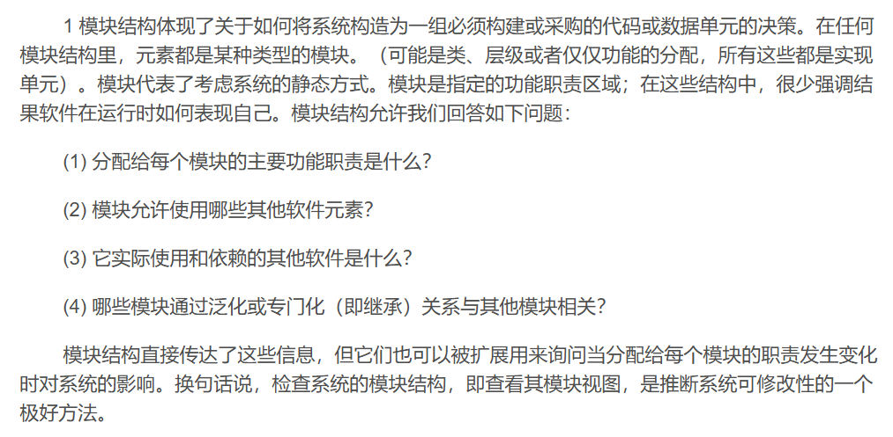
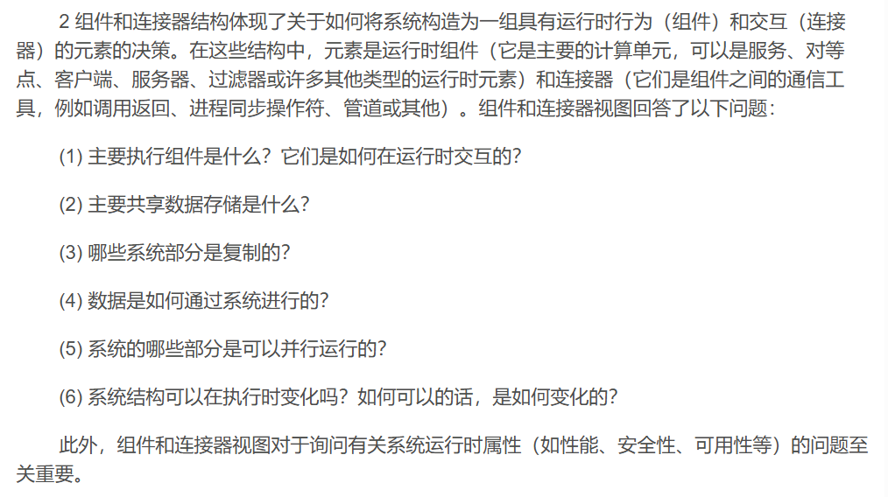
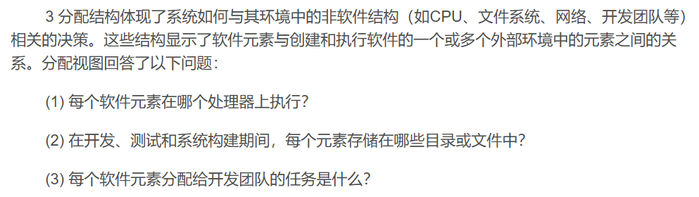

复习提纲
- Part I Introduction of software architecture
- - What? definition, 3 types of structures, architecture
patterns & tactics
- - Why?
- - 4 Context of Software Architecture
- Part II Quality attributes
- - Availability, interoperability, modifiability, performance, security, testability, usability and others
- - Definitions, general scenarios & concrete scenarios of quality attributes, tactics
- - Architecture patterns and tactics
- - Quality attributes modeling and analysis: availability and performance
- Part III Architecture in the life cycle
- - Architecture in agile project: architecture and agility
- - Architecture and requirement: approaches to gather ASR, utility tree
- - Designing an architecture: design strategies, ADD
- - Architecture, implementation, and testing
- - Architecture evaluations
- Other parts
- - Software product lines
- - Architecture in the cloud

1. 什么是软件架构？定义。
   软件架构是一个系统的架构，是用于推理系统所需的一组架构，包括软件元素、它们之间的关系，以及它们的属性。

2. 3种类型的结构
   - Module 模块结构
   一些结构将系统划分为**实现单元**，称为模块。模块被分配特定的计算责任，是编程团队工作分配的基础。
   模块结构体现了关于如何将系统构造为一组必须构建或采购的代码或数据单元的决策。
   
   - Component and Connector 组件和连接器结构
   其他结构关注元素在运行时如何相互交互以执行系统功能。我们称之为组件和连接器（C&C）结构。
   组件和连接器结构体现了关于如何将系统构造为一组具有运行时行为（组件）和交互（连接器）的元素的决策。
   
   - Allocation 分配结构
   分配结构描述了软件结构与系统环境之间的映射。例如，模块被分配给团队进行开发，并分配到文件结构中的位置进行实现、集成和测试。组件被部署到硬件上以执行。
   分配结构体现了系统如何与其环境中的非软件结构（如CPU、文件系统、网络、开发团队等）相关的决策。
   

> 据我理解，可以把软件系统类比做一个人体。一个系统由许多元素构成，我暂且比作人体由许多个器官组成。在A结构里用到了一些元素，在B结构里可以用到的是另一些元素，但是每个结构都是从某个角度对系统的完整理解。类比到人身上，便是医师可以从骨骼组成来看人体，也能从血液循环的角度来看，它们虽然看到的东西不同，但都是对人体（系统）的一种解读。
> 结构是元素本身的集合，视图则是用文档来捕获和表达结构。所以其实结构和视图在实际使用时不加以严格区分，它们都是用来理解系统的同一个工具的不同表现。每个视图只强调系统的某个方面，即从当前角度来理解系统的组成和运转原理。
> 因此视图同样有三种类型：
> - 模块视图类型：为系统的主要模块实现单元编档
> - 构件和连接件视图类型：为系统的构件和连接件执行单元编档
> - 分配视图类型：为软件的开发和执行环境之间的关系编档
> 
> 现在给出几个例子：
> - **分解结构**
> ```
> 在线图书商店系统
> ├── 用户管理模块
>│   ├── 注册子模块
>│   ├── 登录子模块
>│   └── 用户信息管理子模块
>├── 图书管理模块
>│   ├── 图书添加子模块
>│   ├── 图书删除子模块
>│   ├── 图书更新子模块
>│   └── 图书查询子模块
>├── 购物车管理模块
>│   ├── 添加图书到购物车子模块
>│   ├── 从购物车删除图书子模块
>│   └── 查看购物车子模块
>├── 订单管理模块
>│   ├── 创建订单子模块
>│   ├── 查看订单历史子模块
>│   └── 取消订单子模块
>└── 支付管理模块
>    ├── 处理支付子模块
>    └── 生成支付凭证子模块
>```
> - 使用结构
> ```用户管理模块
>├── 使用 注册子模块
>├── 使用 登录子模块
>└── 使用 用户信息管理子模块
>图书管理模块
>├── 使用 图书添加子模块
>├── 使用 图书删除子模块
>├── 使用 图书更新子模块
>└── 使用 图书查询子模块
>购物车管理模块
>├── 使用 添加图书到购物车子模块
>├── 使用 从购物车删除图书子模块
>└── 使用 查看购物车子模块
>订单管理模块
>├── 使用 创建订单子模块
>├── 使用 查看订单历史子模块
>└── 使用 取消订单子模块
>支付管理模块
>├── 使用 处理支付子模块
>└── 使用 生成支付凭证子模块
> ```
> - 层结构
> ```表示层
>├── 用户界面层
>├── 控制层
>业务逻辑层
>├── 用户管理模块
>├── 图书管理模块
>├── 购物车管理模块
>├── 订单管理模块
>└── 支付管理模块
>数据访问层
>├── 用户数据访问模块
>├── 图书数据访问模块
>├── 购物车数据访问模块
>├── 订单数据访问模块
>└── 支付数据访问模块
> ```
> - 服务结构
> ```用户管理服务
>├── 注册服务
>├── 登录服务
>└── 用户信息管理服务
>图书管理服务
>├── 图书添加服务
>├── 图书删除服务
>├── 图书更新服务
>└── 图书查询服务
>购物车管理服务
>├── 添加图书到购物车服务
>├── 从购物车删除图书服务
>└── 查看购物车服务
>订单管理服务
>├── 创建订单服务
>├── 查看订单历史服务
>└── 取消订单服务
>支付管理服务
>├── 处理支付服务
>└── 生成支付凭证服务
> ```
> - 客户端-服务器结构
> ```客户端
>├── 用户界面
>├── 控制器
>服务器
>├── 用户管理服务
>├── 图书管理服务
>├── 购物车管理服务
>├── 订单管理服务
>└── 支付管理服务
>```
> - 点对点结构
> ```用户管理服务
>├── 与 图书管理服务 通信
>├── 与 购物车管理服务 通信
>├── 与 订单管理服务 通信
>└── 与 支付管理服务 通信
>图书管理服务
>├── 与 用户管理服务 通信
>├── 与 购物车管理服务 通信
>├── 与 订单管理服务 通信
>└── 与 支付管理服务 通信
>购物车管理服务
>├── 与 用户管理服务 通信
>├── 与 图书管理服务 通信
>├── 与 订单管理服务 通信
>└── 与 支付管理服务 通信
>订单管理服务
>├── 与 用户管理服务 通信
>├── 与 图书管理服务 通信
>├── 与 购物车管理服务 通信
>└── 与 支付管理服务 通信
>支付管理服务
>├── 与 用户管理服务 通信
>├── 与 图书管理服务 通信
>├── 与 购物车管理服务 通信
>└── 与 订单管理服务 通信
> ```
> - 部署结构
> ```服务器1
>├── 用户管理服务
>├── 图书管理服务
>服务器2
>├── 购物车管理服务
>├── 订单管理服务
>服务器3
>└── 支付管理服务
> ```
> - 工作分配结构
> ```开发团队A
>├── 用户管理模块
>├── 图书管理模块
>开发团队B
>├── 购物车管理模块
>├── 订单管理模块
>开发团队C
>└── 支付管理模块
> ```
>模块视图类型帮助我们理解系统的静态结构和组织，如模块的分解、依赖关系和分层。
>构件和连接件视图类型帮助我们理解系统的动态行为和交互，如服务之间的通信和客户端-服务器结构。
> 分配视图类型帮助我们理解系统元素与外部环境之间的映射，如部署、实现和开发团队的分配。
1. 